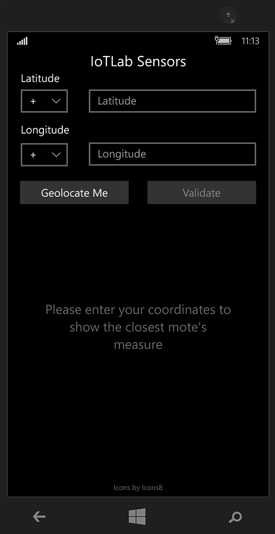
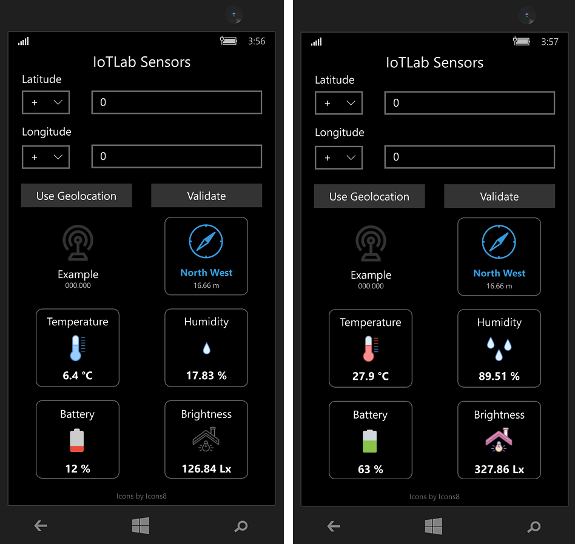
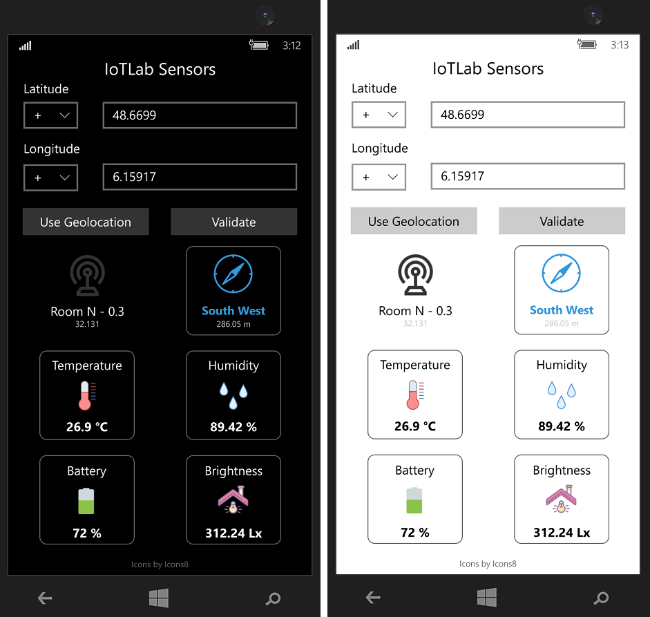
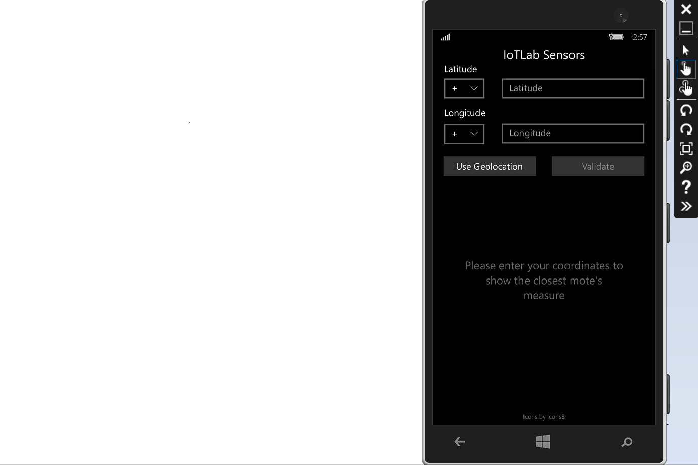

# IoTLab sensors

UWP application with C++ displaying the temperature retrieved by the closest mote using the IoTLab API.

    

## Overview

This application displays the various measures retrieved by the
closest sensor.

In order to retrieve the values, the app is querying the IoTLab, which is a
deployed web platform, acting as a broker for the various sensors.

> 📑 Note: The IoTLab is deployed within
> [TELECOM Nancy](https://telecomnancy.univ-lorraine.fr/), and can't be reached
> without the university's VPN

## Features

- ✅ The application is [made in C++/CX](https://docs.microsoft.com/en-us/cpp/cppcx/visual-c-language-reference-c-cx?view=msvc-160), targeting the Windows Phones
- ✅ The user can either track his position using his GPS or fill the field by
  himself
- ✅ The user's coordinates are validated, and the distance between them
  computed using the [Haversine formula](https://en.wikipedia.org/wiki/Haversine_formula)
- ✅ The app is multi-threaded (UI, HTTP calls and guidance)
- ✅ Each of the mote's data are displayed (name, common name, measures)
- ✅ The icons are dynamically chosen: depending of the measure, the icon will
  be different (e.g. a discharge battery will be shown if the mote is running
  out of battery):

  

- ✅ Support the dark and the light theme:

- ✅ When displaying a mote, the application also provides a compass to indicate
  its position and its distance relatively to the user, as shown in the
  following gif:

- ✅ When clicking on the direction icon, it will open the BingMaps app to guide
  the user toward the mote:

## Credits

This project is made by [Pierre Bouillon](https://www.linkedin.com/in/pierre-bouillon/) and [Victor Varnier](https://www.linkedin.com/in/victor-varnier).

The icons used are from [icons8](https://icons8.com/).
